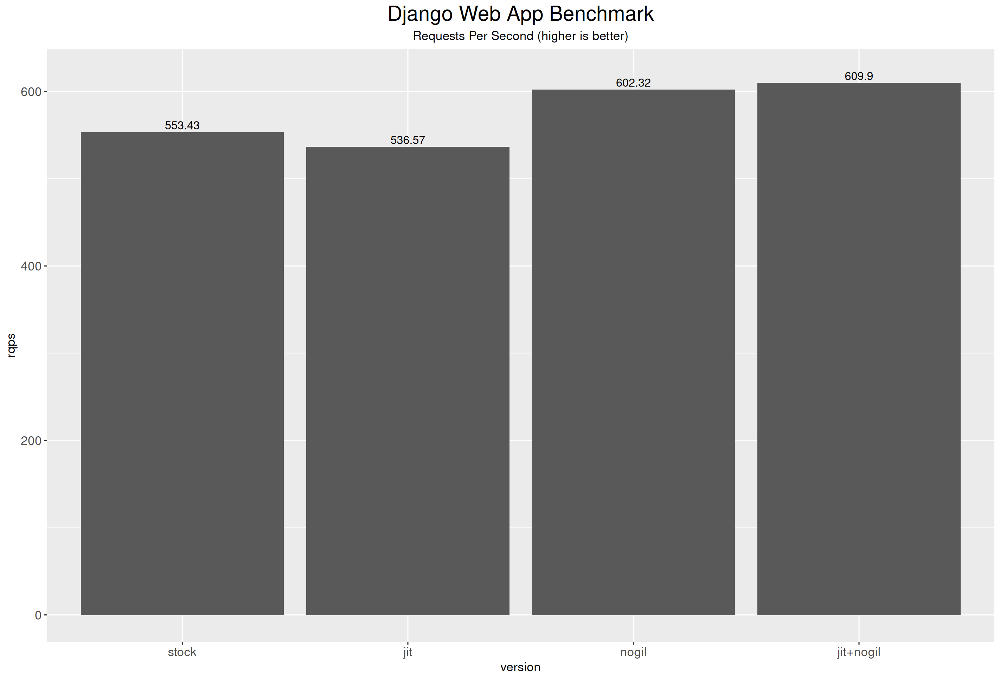
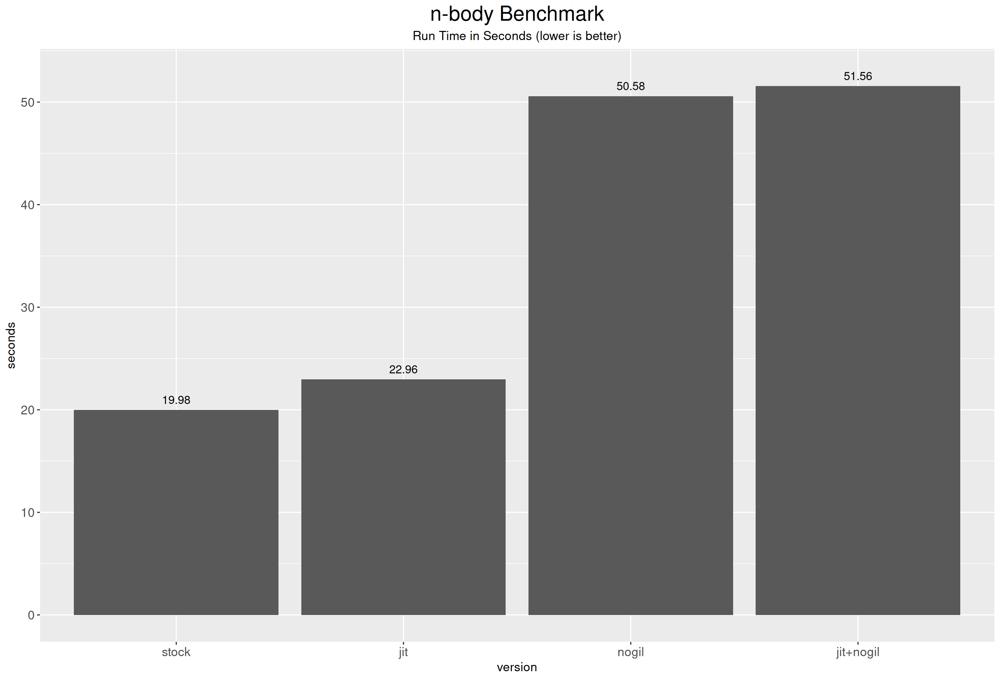
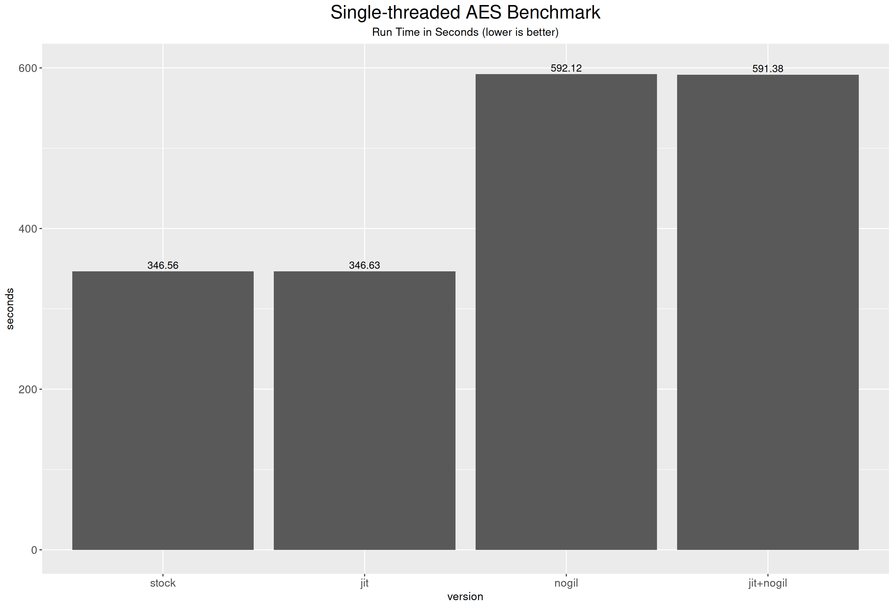
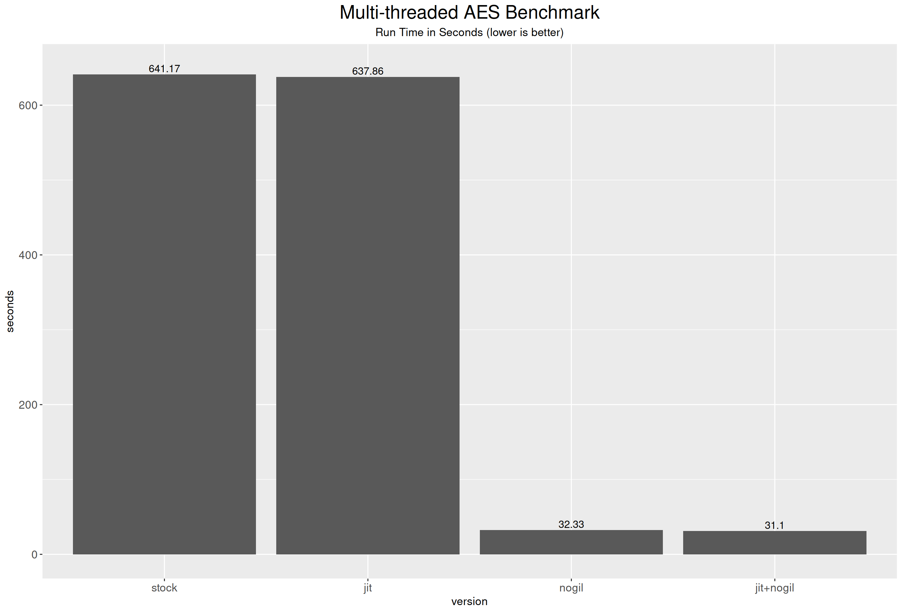

# Testing Python's Experimental JIT and GIL-free Implementation

## Intro
The beta preview of Python 3.13, Python 3.13.0b1, was released in May 8, 2024. It introduced interesting experimental features including Just-In-Time compilation and the removal of the Global Interpreter Lock (GIL). See [PEP 744](https://peps.python.org/pep-0744/) and [PEP 703](https://peps.python.org/pep-0703/) for more information. 

These features are still being heavily developed, and therefore are disabled by default. To enable, you would have to compile CPython using `--enable-experimental-jit` or `--disable-gil` flags. 

This article intends to test the compatibility and the performance of these experimental features.

## Disclaimer

**Python 3.13 is still under heavy development. Content in this article may become out-dated, inaccurate, and/or misleading at any time.**

## Background 

#### Why Global Interpreter Lock Exists in the first place?

To answer this question, we would have to dive into CPython's garbage collector. 

CPython employs a reference-counting technique with cycle-detection to manage memory. Each object is accompanied by an integer value, a reference count, which indicates the number of references to that object. 
For example, when you add an object to a list, you create a new reference to this object, and therefore, its reference count is incremented by 1. Similarly, when you remove this object from the list, its reference count is decremented by 1. Whenever an object's reference count goes to 0, signifying that it is no longer needed, the garbage collect destroys the object and reclaims the memory space the object occupies. 

**For consistency, Incrementing and decrementing the reference counts for all objects must be atomic.** The obvious solution would be implementing a mutex for every object in CPython. However, as you can imagine, this approach would bring enormous overhead since the garbage collection must acquire and release a mutex for every reference count operation. Instead of having fine-grained locks, the CPython development team opted for a global lock. Only the thread that holds this global lock can execute Python bytecode in the interpreter, hence the name Global Interpreter Lock. This approach made sense back when mainstream computers came with single-core CPUs. 

As more and more cores are added to consumer grade CPUs, developers begin to realise the GIL is becoming the bottleneck for their applications. There have been more and more calls for the removal of the GIL.

It's important to understand that the Global Interpreter Lock (GIL) in Python doesn't automatically make your applications thread-safe. The GIL can be released and re-acquired at any point during execution. A general rule is that if an operation can be translated into a single Python opcode, it is thread-safe. However, if it can't, you'll need to use a lock to ensure thread safety.

#### What is a Just-in-Time Compiler?

Python is one of the least performant languages. One of the reasons it is so slow is the lack of a Just-in-Time compiler. If you look at the [source code of CPython interpreter](https://github.com/python/cpython/blob/35c799d79177b962ddace2fa068101465570a29a/Python/ceval.c#L1629), it is essentially a giant switch statement inside a while loop. The switch statement executes appropriate operations based on the value of the opcode, while the while loop keeps moving onto the next opcode. This approach is inefficient.

Many other interpreted yet performant language take advantage of the just-in-time compilation technique. Instead of simply interpreting the bytecode, a just-in-time compiler compiles the bytecode into machine code at run time to speed up execution. However, this causes a noticeable delay at program startup. As a matter of fact, just-in-time compiling an entire program is rare. Most just-in-time compilers would initially interpret the code, later compile the frequently executed code segments into machine code. This technique is called tracing just-in-time compilation. The experimental JIT compiler in CPython 3.13 uses this technique. 

## Test Setup
| Hardware  |                   |
| --------: |:------------------|
| Processor | AMD Threadripper 3970X 32 Core SMT Disabled|
| RAM       | Micron DDR4 3200Mhz 16GB x8 Quad-channel|
| Disk      | Samsung 970 EVO NVMe SSD 500GB

| Software |                    |
| --------: |:------------------|
| OS | Manjaro Linux Kernel 6.6.30 |
| Compilers | GCC 13.2.1 20240417   Clang+LLVM 18.1.6|
| CPython | Python 3.13 commit 2404cd9|

## Building CPython

Only a C89 or C99-compliant compiler and `make` are needed to build CPython from the source. The gcc compiler with your Linux distro should suffice in most cases. 

To build with JIT support, you would also need Clang and LLVM 18. Furthermore, you would also need to sure the executables `clang-18` and `llvm-readobj-18` exist in your `PATH` environment variable. If they don't exist after installing Clang, you can create them by creating symbolic links. For instruction on building Clang and LLVM, see [this link](https://llvm.org/docs/GettingStarted.html).

I compiled 4 CPython interpreters using different build options to conduct test. 

|  Version |  Build Options                                                              |
| -------: |:--------------------------------------------------------------------------- |
| stock    | `--enable-optimizations --enable-lto`                                       |
| jit      | `--enable-optimizations --enable-lto --enable-experimental-jit`             |
| nogil      | `--enable-optimizations --enable-lto --disable-gil --ena`                   |
| jit+nogil  | `--enable-optimizations --enable-lto --enable-experimental-jit --disable-gil`|

Due to [a small bug](https://github.com/python/cpython/pull/118959) that caused build to fail when combining `--disable-gil ` with `--enable-experimental-jit` options, the test versions are compiled at commit `2404cd9` instead of  the official pre-release at `2268289`.

## Compatibility Testings

There have been [significant changes](https://discuss.python.org/t/c-api-my-plan-to-clarify-private-vs-public-functions-in-python-3-13/30131) in the C-API functions in 3.13, many third-party libraries that rely on C-extension may break. 
I tested a handful of popular third party libraries. [This page](http://pyreadiness.org/3.13/) tracks the support status of Python packages on PyPI. 

|            | stock                | jit              | nogil            |   jit+nogil   |
| ----------:| :------------------: | :---------------:| :--------------: | :-----------: |
| keras      | failed to build      | failed to build      | failed to build      | failed to build   |
| numpy      | failed to build          | failed to build      | failed to build      | failed to build   |
| tensorflow | failed to build          | failed to build      | failed to build      | failed to build   |
| pyqt5      | :heavy_check_mark:   |:heavy_check_mark:| run-time crash   | run-time crash|
| Django     | :heavy_check_mark:   |:heavy_check_mark:|:heavy_check_mark:| :heavy_check_mark: |
|cryptography| :heavy_check_mark:   |:heavy_check_mark:| run-time crash   | run-time crash|
|PyCryptodome| :heavy_check_mark:   | :heavy_check_mark: | :heavy_check_mark: | :heavy_check_mark: |
|python_mysql_connector | :heavy_check_mark:| :heavy_check_mark:| :heavy_check_mark:| :heavy_check_mark:|
| requests   | :heavy_check_mark:   | :heavy_check_mark:| :heavy_check_mark:|:heavy_check_mark:|

## C-extension

When implementing a module using Python's C-extension with the GIL in mind, you may temporarily release the GIL to let other Python threads to run, and later re-acquire it, using the `Py_BEGIN_ALLOW_THREADS` and `Py_END_ALLOW_THREADS` macros respectively. The typical scenarios include blocking system calls and long-running computationally expensive operations. 

In this part, I wrote a [simple C-extension module](scripts/dummy.c) to find out the compatibility surrounding Python's C-API. 

Base on my observation, you must use the corresponding `pyconfig.h` file generated when you compiled your CPython to compile your module, otherwise, your C-extension module will crash the interpreter upon importing, regardless whether the module is GIL aware or not. **In other words, compiled C module binaries are *not* portable across GIL-enabled and GIL-free versions of CPython.**

## Thread-safety

Certain operations on Python's built-in types are atomic and are therefore thread-safe guaranteed by the GIL,
such operations include `push`, `pop`, and `extend` on lists and dictionaries.

[A script](scripts/thread_safety.py) is written to check whether these operations are still thread-safe without the GIL.

Based on the results, these operations are still thread-safe with the absence of GIL.

## Performance Testings

### Django Web Server Benchmark

In this section, I wrote a trivial Django web server to conduct this test. To simulate real-world applications, the requested page involve database querying (SQLite backend) and template rendering. [Vegeta](https://github.com/tsenart/vegeta) is used to stress test against the web application using 128 workers over a 20-second duration. 

### n-body Simulation Benchmark

`nbody.py` is [an n-body simulation program](https://salsa.debian.org/benchmarksgame-team/benchmarksgame/) written for the Debian Benchmark Games. It is a single-threaded application.  This program is run for 5000000 iterations, i.e. `python nbody.py 5000000`.

### Single-threaded AES Encryption Benchmark

Python's popular cryptography libraries, such as `PyCryptodome` and `cryptography`, are built with C-extension, implementing CPU-intense operations in C. 
Just-in-time compilation and the presence/absence of the Global Interpreter Lock would likely have little impact on their performance. 
Therefore, I used [a library](https://github.com/boppreh/aes) that implements AES block cipher in pure Python to benchmark the performance. 

##### Work Load
A 100MB file read from `/dev/urandom` is used to encryption. This file is first read into memory, split into 1MB chunks and put into a queue, then spawning multiple threads (depends on the number of CPUs, regardless of the presence of GIL) to perform the encryption.  See `scripts/aes_encryption.py` for implementation details. 

### Multi-threaded AES Encryption Benchmark

Similar to the single-threaded AES encryption, except that the input file is divided into 1MB chunks and subsequently processed with 32 threads (corresponds to 32-core CPU). This test is to measure the scaling factor for multi-threaded workloads without GIL.

### Conclusion

At this stage of development, the JIT compiler does not offer performance gain. 

Python suffers from a huge performance drop (more than 50%) by disabling the GIL. However, it enables access to multi-CPU by multi-threading. 

In single-threaded benchmarks test, the `stock` version is the top performer, followed by the `jit` version, slightly slower depending on the workload. 
However, I observed a huge performance degradation in GIL free version. In my speculation, the main cause is the overhead introduced by the fine-grain locks.

This test is to measure the performance scaling factor for multi-threaded workloads when GIL is removed.

## An Interesting Discovery

From the AES benchmark results above, I noticed something rather strange. 

Surprisingly, in the **GIL-enabled** `stock` interpreter, the multi-threaded AES encryption is significantly slower than its single-threaded counterpart for the same workload. This unexpected performance difference initially led me to suspect there might have been substantial overhead in my parallel implementation. However, after testing various other implementations, I concluded this was not the case. 

**In a nutshell, the issue is that the performance of multi-threaded cpu-intense workloads scales down as the number of available CPUs goes up.**

This issue is not specific to the Python 3.13 pre-release as I was able to re-produce similar results with Python 3.12.3 and 3.11.3.
 
To delve deeper into this issue, I modified the AES benchmark script to periodically record the CPU index on which each thread is executing, and ran it with 32 threads. On Linux, the scheduler evenly distributes all 32 threads across all available CPUs, in accordance with the GIL's rule that only one thread can execute while others are waiting, but not spinning, for the lock. However, on Windows 10 (version 22H2), the situation is more complex. When the system is mostly idle, the Windows scheduler concentrates all 32 threads in one or two cores, resulting in performance similar to the single-threaded implementation. But if the system is moderately under load, the scheduler would distribute the 32 threads across all available CPUs, leading to a performance penalty similar to what is observed on Linux.  

An easy workaround is pinning all threads onto one CPU, either by `taskset` command on Linux or `start /AFFINITY {MASK}` on Windows, or programmatically by calling `os.sched_setaffinity` function.

Further research reveled that similar issues have been noticed [as early as 2010](http://www.dabeaz.com/python/UnderstandingGIL.pdf), but did not offer explanation or speculation. 
[Another article](https://github.com/zpoint/CPython-Internals/blob/master/Interpreter/gil/gil.md) claimed this is due to how GIL was implemented, and that the GIL has been re-implemented in Python 3.2 to address this issue. 

## References

http://www.dabeaz.com/python/UnderstandingGIL.pdf

https://github.com/zpoint/CPython-Internals/blob/master/Interpreter/gil/gil.md

https://github.com/python/cpython/blob/main/Tools/jit/README.md

https://docs.python.org/3/faq/library.html#what-kinds-of-global-value-mutation-are-thread-safe

https://peps.python.org/pep-0744/

https://peps.python.org/pep-0703/

https://en.wikipedia.org/wiki/Just-in-time_compilation

https://discuss.python.org/t/c-api-my-plan-to-clarify-private-vs-public-functions-in-python-3-13/30131

